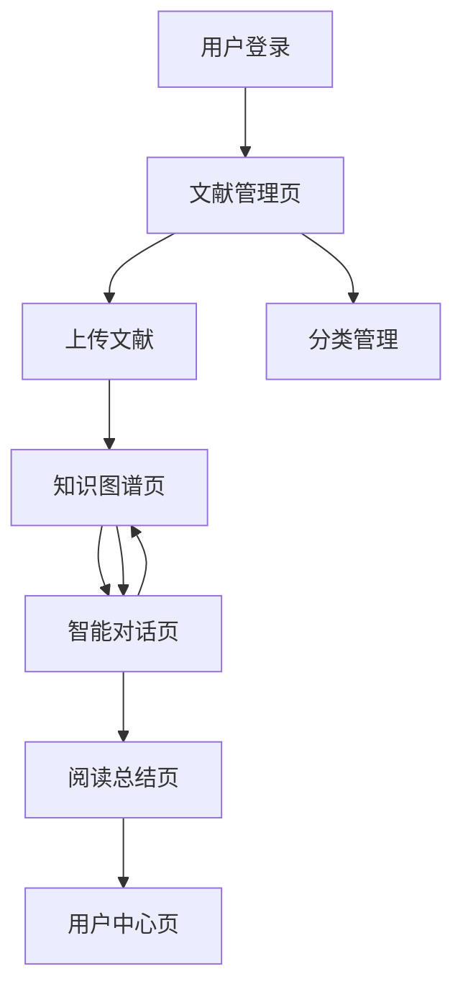

# 智能文献管理系统 - 产品需求文档

## 1. 产品概述

智能文献管理系统是一个集文献管理、知识提取、智能对话于一体的综合性学术研究平台。系统通过AI技术自动提取文献知识图谱，构建知识库，并提供基于知识图谱的智能对话服务，帮助研究人员高效管理文献、快速获取知识洞察。

该系统主要解决研究人员在文献管理中面临的信息过载、知识碎片化、检索效率低等问题，通过智能化手段提升学术研究效率。

目标是打造学术研究领域的智能助手，服务于高校、科研院所、企业研发等机构的研究人员。

## 2. 核心功能

### 2.1 用户角色

| 角色   | 注册方式  | 核心权限                  |
| ---- | ----- | --------------------- |
| 普通用户 | 手机号注册 | 文献上传、基础管理、知识图谱查看、智能对话 |
| 高级用户 | 付费升级  | 批量导入、高级分析、团队协作、API访问  |
| 管理员  | 系统分配  | 用户管理、系统配置、数据统计、内容审核   |

### 2.2 功能模块

我们的智能文献管理系统包含以下主要页面：

1. **首页**：聊天页面，类似于ChatGPT的网页，可选择单个或多个文献对话，也可以不选择，可以选择对话中的信息保存成文件，文件自动保存到文献管理页面中的个人笔记区域
2. **文献管理页**：文献列表、分类管理、批量操作、导入导出
3. **知识图谱**：每个文献右侧应该有查看图片的按钮，图谱可视化、节点详情、关系探索、图谱编辑
4. **阅读总结页**：文献阅读器、自动摘要、笔记管理、标注工具
5. **用户中心页**：个人信息、使用统计、订阅管理、设置配置

### 2.3 页面详情

| 页面名称  | 模块名称  | 功能描述              |
| ----- | ----- | ----------------- |
| 首页    | 搜索模块  | 全文检索、智能推荐、快速筛选    |
| 首页    | 概览模块  | 文献统计、知识图谱概览、最近活动  |
| 文献管理页 | 文献列表  | 展示、排序、筛选、批量选择文献   |
| 文献管理页 | 分类管理  | 创建、编辑、删除分类标签      |
| 文献管理页 | 导入导出  | 支持多种格式的文献导入导出     |
| 知识图谱页 | 图谱可视化 | 交互式知识图谱展示、缩放、拖拽   |
| 知识图谱页 | 节点管理  | 查看、编辑、删除知识节点和关系   |
| 智能对话页 | 对话界面  | 自然语言问答、上下文理解、多轮对话 |
| 智能对话页 | 知识问答  | 基于文献库的专业问题解答      |
| 阅读总结页 | 文献阅读器 | PDF阅读、页面导航、全屏模式   |
| 阅读总结页 | 自动摘要  | AI生成文献摘要、关键词提取    |
| 阅读总结页 | 笔记管理  | 创建、编辑、分类个人笔记      |
| 用户中心页 | 个人信息  | 用户资料管理、头像上传       |
| 用户中心页 | 使用统计  | 阅读时长、文献数量、对话次数统计  |

## 3. 核心流程

**普通用户流程：**
用户注册登录 → 上传文献 → 系统自动解析提取知识 → 查看知识图谱 → 与AI助手对话获取洞察 → 生成阅读总结

**高级用户流程：**
用户登录 → 批量导入文献 → 自定义分类管理 → 团队协作共享 → 高级分析报告 → API集成使用

**管理员流程：**
管理员登录 → 用户管理 → 内容审核 → 系统配置 → 数据统计分析 → 系统维护

## 4. 用户界面设计

### 4.1 设计风格

* **主色调**：深蓝色(#1E3A8A)、浅蓝色(#3B82F6)

* **辅助色**：灰色(#6B7280)、绿色(#10B981)、橙色(#F59E0B)

* **按钮样式**：圆角矩形、渐变背景、悬停效果

* **字体**：思源黑体、Inter，主要字号14px-16px

* **布局风格**：卡片式设计、左侧导航、响应式布局

* **图标风格**：线性图标、统一风格、适当使用学术相关emoji📚📊🔍

### 4.2 页面设计概览

| 页面名称  | 模块名称  | UI元素                    |
| ----- | ----- | ----------------------- |
| 首页    | 搜索模块  | 大型搜索框、智能提示、筛选标签、卡片式结果展示 |
| 首页    | 概览模块  | 统计卡片、环形图表、时间轴、快捷操作按钮    |
| 文献管理页 | 文献列表  | 表格视图、卡片视图切换、多选框、操作按钮组   |
| 知识图谱页 | 图谱可视化 | 全屏画布、节点样式、连线动画、工具栏、侧边面板 |
| 智能对话页 | 对话界面  | 聊天气泡、输入框、发送按钮、历史记录、快捷问题 |
| 阅读总结页 | 文献阅读器 | PDF查看器、目录导航、工具栏、标注高亮    |

### 4.3 响应式设计

系统采用桌面优先的响应式设计，支持平板和移动端适配，针对触屏设备优化交互体验，确保在不同设备上都能提供良好的用户体验。
