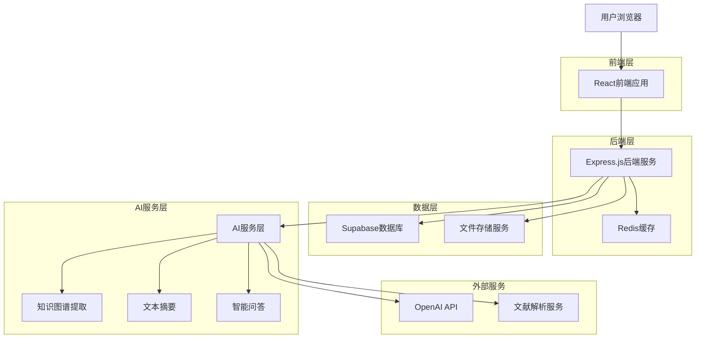
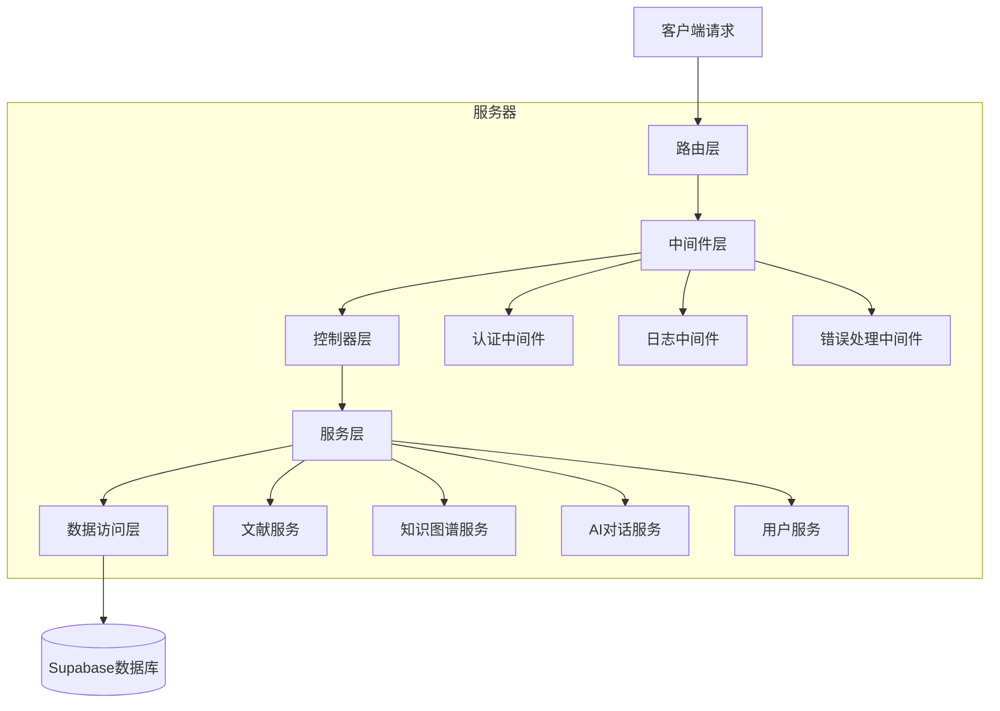
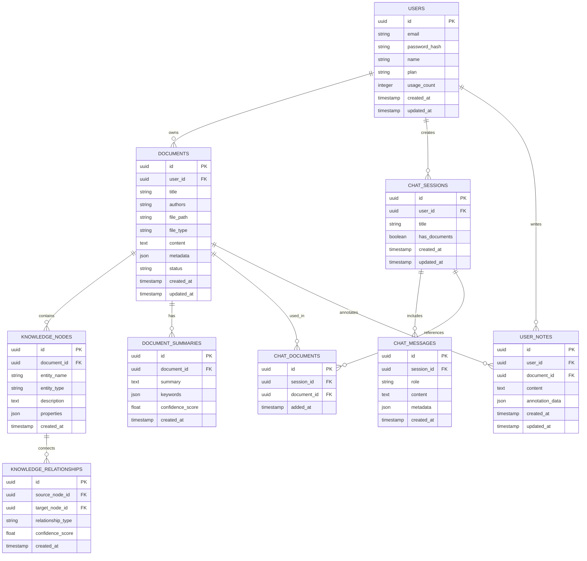

# 智能文献管理系统 - 技术架构文档

## 1. 架构设计



## 2. 技术描述

- **前端**: React@18 + TypeScript + Tailwind CSS + Vite + React Router + Zustand
- **后端**: Express.js@4 + TypeScript + JWT认证
- **数据库**: Supabase (PostgreSQL)
- **缓存**: Redis@7
- **文件存储**: Supabase Storage
- **AI服务**: OpenAI GPT-4 + 自研知识图谱算法
- **文档解析**: PDF.js + 自然语言处理库

## 3. 路由定义

| 路由 | 用途 |
|------|------|
| / | 首页聊天页面，类似ChatGPT界面，支持文献选择对话 |
| /login | 登录页面，用户身份验证 |
| /register | 注册页面，新用户注册 |
| /documents | 文献管理页面，文献列表、分类管理、个人笔记区域 |
| /documents/:id | 文献详情页面，单个文献的详细信息 |
| /knowledge-graph | 知识图谱页面，可视化知识网络，文献右侧查看按钮 |
| /reader/:id | 阅读总结页面，文献阅读器、自动摘要、笔记管理 |
| /profile | 用户中心页面，个人信息、使用统计、订阅管理 |
| /admin | 管理员页面，系统管理功能 |

## 4. API定义

### 4.1 核心API

**用户认证相关**
```
POST /api/auth/login
```

请求参数:
| 参数名 | 参数类型 | 是否必需 | 描述 |
|--------|----------|----------|------|
| email | string | true | 用户邮箱 |
| password | string | true | 用户密码 |

响应参数:
| 参数名 | 参数类型 | 描述 |
|--------|----------|------|
| success | boolean | 登录是否成功 |
| token | string | JWT访问令牌 |
| user | object | 用户信息 |

**文献管理相关**
```
GET /api/documents
POST /api/documents
PUT /api/documents/:id
DELETE /api/documents/:id
```

**知识图谱相关**
```
GET /api/knowledge-graph
POST /api/knowledge-graph/extract
```

**智能对话相关**
```
POST /api/chat/message
GET /api/chat/history
POST /api/chat/save-to-notes
GET /api/chat/sessions
POST /api/chat/sessions
DELETE /api/chat/sessions/:id
```

**文献解析相关**
```
POST /api/documents/upload
POST /api/documents/parse
GET /api/documents/:id/summary
GET /api/documents/:id/knowledge-graph
```

**用户笔记相关**
```
GET /api/notes
POST /api/notes
PUT /api/notes/:id
DELETE /api/notes/:id
GET /api/notes/by-document/:documentId
```

示例请求:
```json
{
  "email": "user@example.com",
  "password": "password123"
}
```

## 5. 服务器架构图



## 6. 数据模型

### 6.1 数据模型定义



### 6.2 数据定义语言

**用户表 (users)**
```sql
-- 创建用户表
CREATE TABLE users (
    id UUID PRIMARY KEY DEFAULT gen_random_uuid(),
    email VARCHAR(255) UNIQUE NOT NULL,
    password_hash VARCHAR(255) NOT NULL,
    name VARCHAR(100) NOT NULL,
    plan VARCHAR(20) DEFAULT 'free' CHECK (plan IN ('free', 'premium', 'enterprise')),
    usage_count INTEGER DEFAULT 0,
    created_at TIMESTAMP WITH TIME ZONE DEFAULT NOW(),
    updated_at TIMESTAMP WITH TIME ZONE DEFAULT NOW()
);

-- 创建索引
CREATE INDEX idx_users_email ON users(email);
CREATE INDEX idx_users_plan ON users(plan);

-- 设置权限
GRANT SELECT ON users TO anon;
GRANT ALL PRIVILEGES ON users TO authenticated;
```

**文献表 (documents)**
```sql
-- 创建文献表
CREATE TABLE documents (
    id UUID PRIMARY KEY DEFAULT gen_random_uuid(),
    user_id UUID REFERENCES users(id) ON DELETE CASCADE,
    title VARCHAR(500) NOT NULL,
    authors TEXT,
    file_path VARCHAR(500),
    file_type VARCHAR(50),
    content TEXT,
    metadata JSONB,
    status VARCHAR(20) DEFAULT 'processing' CHECK (status IN ('processing', 'completed', 'failed')),
    created_at TIMESTAMP WITH TIME ZONE DEFAULT NOW(),
    updated_at TIMESTAMP WITH TIME ZONE DEFAULT NOW()
);

-- 创建索引
CREATE INDEX idx_documents_user_id ON documents(user_id);
CREATE INDEX idx_documents_title ON documents USING gin(to_tsvector('english', title));
CREATE INDEX idx_documents_status ON documents(status);
CREATE INDEX idx_documents_created_at ON documents(created_at DESC);

-- 设置权限
GRANT SELECT ON documents TO anon;
GRANT ALL PRIVILEGES ON documents TO authenticated;
```

**知识节点表 (knowledge_nodes)**
```sql
-- 创建知识节点表
CREATE TABLE knowledge_nodes (
    id UUID PRIMARY KEY DEFAULT gen_random_uuid(),
    document_id UUID REFERENCES documents(id) ON DELETE CASCADE,
    entity_name VARCHAR(200) NOT NULL,
    entity_type VARCHAR(50) NOT NULL,
    description TEXT,
    properties JSONB,
    created_at TIMESTAMP WITH TIME ZONE DEFAULT NOW()
);

-- 创建索引
CREATE INDEX idx_knowledge_nodes_document_id ON knowledge_nodes(document_id);
CREATE INDEX idx_knowledge_nodes_entity_name ON knowledge_nodes(entity_name);
CREATE INDEX idx_knowledge_nodes_entity_type ON knowledge_nodes(entity_type);

-- 设置权限
GRANT SELECT ON knowledge_nodes TO anon;
GRANT ALL PRIVILEGES ON knowledge_nodes TO authenticated;
```

**知识关系表 (knowledge_relationships)**
```sql
-- 创建知识关系表
CREATE TABLE knowledge_relationships (
    id UUID PRIMARY KEY DEFAULT gen_random_uuid(),
    source_node_id UUID REFERENCES knowledge_nodes(id) ON DELETE CASCADE,
    target_node_id UUID REFERENCES knowledge_nodes(id) ON DELETE CASCADE,
    relationship_type VARCHAR(100) NOT NULL,
    confidence_score FLOAT DEFAULT 0.0 CHECK (confidence_score >= 0.0 AND confidence_score <= 1.0),
    created_at TIMESTAMP WITH TIME ZONE DEFAULT NOW()
);

-- 创建索引
CREATE INDEX idx_knowledge_relationships_source ON knowledge_relationships(source_node_id);
CREATE INDEX idx_knowledge_relationships_target ON knowledge_relationships(target_node_id);
CREATE INDEX idx_knowledge_relationships_type ON knowledge_relationships(relationship_type);

-- 设置权限
GRANT SELECT ON knowledge_relationships TO anon;
GRANT ALL PRIVILEGES ON knowledge_relationships TO authenticated;
```

**对话会话表 (chat_sessions)**
```sql
-- 创建对话会话表
CREATE TABLE chat_sessions (
    id UUID PRIMARY KEY DEFAULT gen_random_uuid(),
    user_id UUID REFERENCES users(id) ON DELETE CASCADE,
    title VARCHAR(200) DEFAULT '新对话',
    has_documents BOOLEAN DEFAULT FALSE,
    created_at TIMESTAMP WITH TIME ZONE DEFAULT NOW(),
    updated_at TIMESTAMP WITH TIME ZONE DEFAULT NOW()
);

-- 创建索引
CREATE INDEX idx_chat_sessions_user_id ON chat_sessions(user_id);
CREATE INDEX idx_chat_sessions_updated_at ON chat_sessions(updated_at DESC);
CREATE INDEX idx_chat_sessions_has_documents ON chat_sessions(has_documents);

-- 设置权限
GRANT SELECT ON chat_sessions TO anon;
GRANT ALL PRIVILEGES ON chat_sessions TO authenticated;
```

**对话文献关联表 (chat_documents)**
```sql
-- 创建对话文献关联表
CREATE TABLE chat_documents (
    id UUID PRIMARY KEY DEFAULT gen_random_uuid(),
    session_id UUID REFERENCES chat_sessions(id) ON DELETE CASCADE,
    document_id UUID REFERENCES documents(id) ON DELETE CASCADE,
    added_at TIMESTAMP WITH TIME ZONE DEFAULT NOW(),
    UNIQUE(session_id, document_id)
);

-- 创建索引
CREATE INDEX idx_chat_documents_session_id ON chat_documents(session_id);
CREATE INDEX idx_chat_documents_document_id ON chat_documents(document_id);

-- 设置权限
GRANT SELECT ON chat_documents TO anon;
GRANT ALL PRIVILEGES ON chat_documents TO authenticated;
```

**初始化数据**
```sql
-- 插入示例用户
INSERT INTO users (email, password_hash, name, plan) VALUES
('admin@example.com', '$2b$10$example_hash', '系统管理员', 'enterprise'),
('demo@example.com', '$2b$10$example_hash', '演示用户', 'free');
```