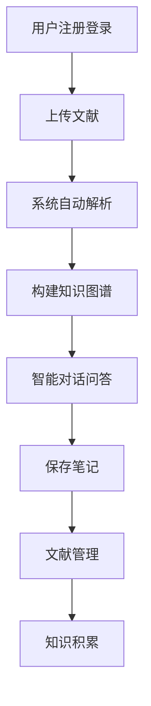
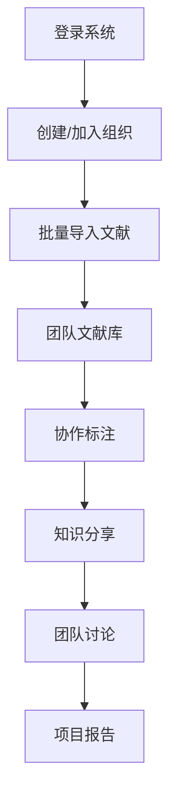
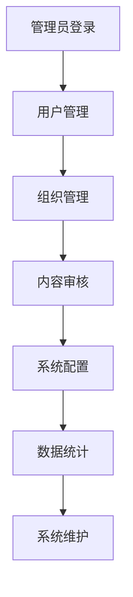

# 智能文献管理系统 - 产品需求文档

## 1. 产品概述

### 1.1 产品定位

智能文献管理系统是一个集文献管理、知识提取、智能对话于一体的综合性学术研究平台。系统通过AI技术自动提取文献知识图谱，构建知识库，并提供基于知识图谱的智能对话服务，帮助研究人员高效管理文献、快速获取知识洞察。

### 1.2 核心价值

该系统主要解决研究人员在文献管理中面临的核心痛点：
- **信息过载**：海量文献难以有效筛选和管理
- **知识碎片化**：文献间关联关系不清晰，难以形成系统性认知
- **检索效率低**：传统关键词搜索无法满足深度语义理解需求
- **协作困难**：团队间文献共享和知识传承缺乏有效工具

### 1.3 目标用户

**主要用户群体：**
- 高校研究生、博士生及科研人员
- 科研院所的研究员和学者
- 企业研发部门的技术人员
- 学术期刊编辑和审稿专家

**使用场景：**
- 文献调研和综述撰写
- 学术论文写作和引用管理
- 团队协作研究项目
- 知识管理和传承

## 2. 功能需求

### 2.1 用户角色与权限

| 用户角色 | 注册方式           | 核心权限                                    | 使用限制                |
| -------- | ------------------ | ------------------------------------------- | ----------------------- |
| 普通用户 | 手机号注册/微信登录 | 文献上传、基础管理、智能对话、个人笔记管理   | 单日上传10篇文档        |
| 高级用户 | 付费升级           | 普通用户权限 + 批量导入、加入组织| 单日上传100篇文档       |
| 管理员   | 付费升级           | 高级用户权限 + 创建组织、用户管理 | 单日上传500篇文档       |

### 2.2 核心功能模块

#### 2.2.1 智能对话模块
- **对话界面**：类似ChatGPT的聊天界面，支持多轮对话
- **文献选择**：可选择单个或多个文献作为对话上下文
- **知识问答**：基于文献内容进行智能问答
- **对话保存**：将有价值的对话内容保存为个人笔记

#### 2.2.2 文献管理模块
- **文献上传**：支持PDF、Word、TXT等多种格式
<!-- - **批量导入**：支持从Zotero、EndNote等工具批量导入 -->
- **分类管理**：自定义标签和文件夹分类
- **搜索筛选**：全文搜索、标签筛选、时间筛选
<!-- - **导入导出**：支持多种格式的文献数据导入导出 -->

#### 2.2.3 知识图谱模块
- **自动构建**：基于文献内容自动提取实体和关系
- **可视化展示**：交互式图谱界面，支持缩放、拖拽
<!-- - **关系分析**：展示概念间的关联关系和强度
- **路径查找**：查找概念间的关联路径 -->

#### 2.2.4 协作管理模块
- **组织创建**：创建研究团队或项目组织
- **成员管理**：邀请成员、分配权限、角色管理
- **文献共享**：组织内文献库共享和协作标注
<!-- - **讨论交流**：基于文献的团队讨论和知识分享 -->

### 2.3 页面架构设计

根据功能需求，系统共包含**10个主要页面**：

| 页面名称     | 页面类型 | 主要功能                                                     |
| ------------ | -------- | ------------------------------------------------------------ |
| 登录注册页   | 入口页面 | 手机号注册、微信扫码登录、密码找回、验证码验证               |
| 智能对话页   | 核心页面 | ChatGPT风格对话界面、文献选择器、对话历史、保存对话为笔记    |
| 文献管理页   | 核心页面 | 文献列表、批量导入、分类管理、搜索筛选、表格/卡片视图切换    |
| 个人笔记页   | 功能页面 | 笔记列表、分类管理、搜索、编辑、导出功能                     |
| 文献详情页   | 详情页面 | PDF/文档查看、目录导航、全文搜索、标注高亮、书签管理         |
| 文献对话页   | 功能页面 | 基于当前文献的AI对话、问答记录、导出到笔记                   |
| 知识图谱页   | 可视化页面 | 交互式知识图谱、节点关系展示、缩放平移、查找节点信息         |
| 组织管理页   | 协作页面 | 创建/加入组织、成员管理、权限设置、共享文献库                |
| 组织统计页   | 分析页面 | 组织文献统计、成员活跃度分析、知识图谱统计                   |
| 用户中心页   | 设置页面 | 个人资料编辑、账号设置、主题切换、订阅管理                   |

**页面导航结构：**
```
├── 智能对话页（首页）
├── 文献管理页
│   ├── 文献详情页
│   │   └── 文献对话页
│   └── 个人笔记页
├── 知识图谱页
├── 组织管理页
│   └── 组织统计页
└── 用户中心页
```

## 3. 用户流程设计

### 3.1 核心用户流程

#### 3.1.1 普通用户使用流程


**详细步骤：**
1. **注册登录**：手机号注册或微信扫码登录
2. **文献上传**：上传PDF、Word等格式文献
3. **自动解析**：系统提取文献关键信息和实体
4. **知识图谱**：自动构建文献知识图谱
5. **智能对话**：基于文献内容进行AI问答
6. **笔记管理**：保存有价值的对话和思考
7. **持续积累**：形成个人知识库

#### 3.1.2 高级用户协作流程


#### 3.1.3 管理员管理流程


### 3.2 关键交互流程

#### 3.2.1 文献上传与处理流程
1. **文件选择**：支持拖拽上传或点击选择
2. **格式检测**：自动识别文件格式和编码
3. **内容提取**：提取文本、图表、引用信息
4. **实体识别**：识别人名、机构、概念等实体
5. **关系抽取**：分析实体间的关联关系
6. **图谱构建**：生成可视化知识图谱
7. **索引建立**：建立全文搜索索引

#### 3.2.2 智能对话交互流程
1. **对话发起**：用户输入问题或选择预设问题
2. **上下文理解**：结合选定文献和对话历史
3. **知识检索**：从知识图谱中检索相关信息
4. **答案生成**：基于检索结果生成回答
5. **结果展示**：展示答案并提供引用来源
6. **对话延续**：支持追问和深入讨论

## 4. 界面设计规范

### 4.1 设计理念

**设计原则：**
- **简洁高效**：界面简洁明了，操作流程高效便捷
- **学术专业**：体现学术研究的专业性和严谨性
- **智能友好**：突出AI功能，提供智能化交互体验
- **协作导向**：支持团队协作，促进知识分享

### 4.2 页面布局设计

#### 4.3.1 整体布局
```
┌─────────────────────────────────────────────────────────┐
│                    顶部导航栏                           │
├─────────────┬───────────────────────────────────────────┤
│             │                                         │
│   左侧      │              主内容区域                  │
│   导航菜单   │                                         │
│             │                                         │
│             │                                         │
└─────────────┴───────────────────────────────────────────┘
```

#### 4.3.2 核心页面设计要点

**智能对话页：**
- 类ChatGPT界面，对话气泡设计
- 左侧文献选择面板，支持多选
- 右侧对话历史和快捷问题
- 底部输入框，支持文件拖拽

**文献管理页：**
- 顶部搜索和筛选工具栏
- 左侧分类树形菜单
- 中间文献列表，支持表格/卡片切换
- 右侧文献预览面板

**知识图谱页：**
- 全屏画布，支持缩放和拖拽
- 左侧图谱控制面板
- 右侧节点详情面板
- 底部时间轴和筛选器

### 4.4 交互设计规范

#### 4.4.1 操作反馈
- **加载状态**：骨架屏 + 进度条
- **成功操作**：绿色提示 + 图标
- **错误处理**：红色提示 + 具体错误信息
- **确认操作**：模态框确认重要操作
