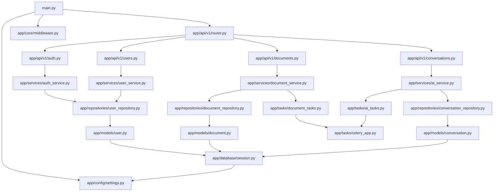
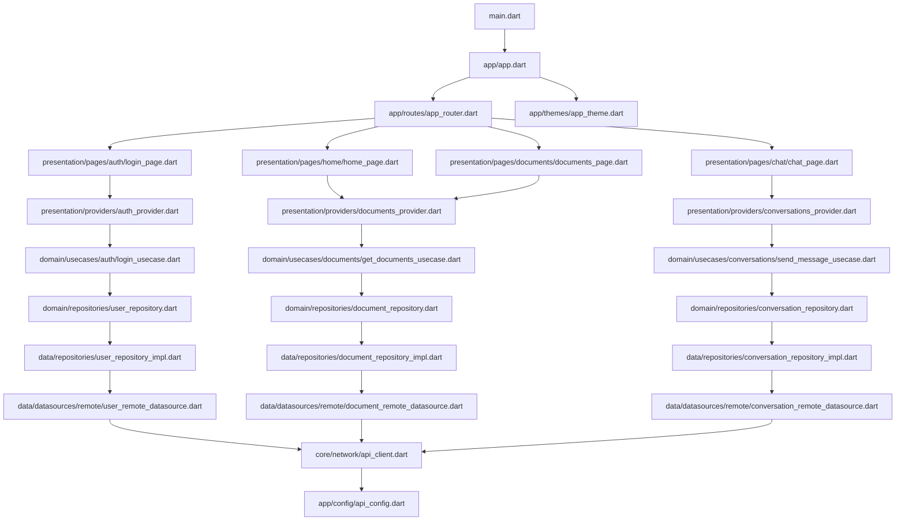

# 智能文献管理系统 - 代码开发规划文档

## 1. 项目根目录结构

```
intelligent-literature-system/
├── README.md                           # 项目说明文档
├── docker-compose.yml                  # Docker容器编排配置
├── .gitignore                          # Git忽略文件配置
├── .env.example                        # 环境变量模板文件
├── docs/                               # 项目文档目录
│   ├── api/                           # API文档
│   ├── deployment/                    # 部署文档
│   └── development/                   # 开发文档
├── backend/                            # Python后端服务
│   ├── app/                           # 应用核心代码
│   ├── tests/                         # 测试代码
│   ├── migrations/                    # 数据库迁移文件
│   ├── scripts/                       # 脚本文件
│   ├── requirements.txt               # Python依赖包
│   ├── Dockerfile                     # 后端Docker配置
│   ├── .env                          # 后端环境变量
│   └── main.py                       # 应用入口文件
├── frontend/                           # Flutter前端应用
│   ├── lib/                          # Flutter源代码
│   ├── test/                         # 测试代码
│   ├── web/                          # Web构建输出
│   ├── build/                        # 构建输出目录
│   ├── assets/                       # 静态资源
│   ├── pubspec.yaml                  # Flutter依赖配置
│   └── analysis_options.yaml         # 代码分析配置
├── infrastructure/                     # 基础设施配置
│   ├── kubernetes/                    # K8s部署配置
│   ├── terraform/                     # 基础设施即代码
│   └── monitoring/                    # 监控配置
└── scripts/                           # 项目脚本
    ├── setup.sh                      # 环境初始化脚本
    ├── deploy.sh                     # 部署脚本
    └── backup.sh                     # 数据备份脚本
```

## 2. 后端目录结构详解

### 2.1 核心应用目录 (backend/app/)

```
backend/app/
├── __init__.py                        # 包初始化文件
├── main.py                            # FastAPI应用入口
├── config/                            # 配置管理
│   ├── __init__.py
│   ├── settings.py                    # 应用配置类
│   ├── database.py                    # 数据库配置
│   └── logging.py                     # 日志配置
├── core/                              # 核心功能模块
│   ├── __init__.py
│   ├── security.py                    # 安全认证相关
│   ├── dependencies.py                # 依赖注入
│   ├── exceptions.py                  # 自定义异常
│   ├── middleware.py                  # 中间件
│   └── utils.py                       # 工具函数
├── models/                            # 数据模型
│   ├── __init__.py
│   ├── base.py                        # 基础模型类
│   ├── user.py                        # 用户模型
│   ├── document.py                    # 文档模型
│   ├── conversation.py                # 对话模型
│   ├── message.py                     # 消息模型
│   ├── note.py                        # 笔记模型
│   └── organization.py                # 组织模型
├── schemas/                           # Pydantic数据验证模式
│   ├── __init__.py
│   ├── base.py                        # 基础模式类
│   ├── user.py                        # 用户数据模式
│   ├── document.py                    # 文档数据模式
│   ├── conversation.py                # 对话数据模式
│   ├── message.py                     # 消息数据模式
│   ├── note.py                        # 笔记数据模式
│   └── organization.py                # 组织数据模式
├── api/                               # API路由
│   ├── __init__.py
│   ├── deps.py                        # API依赖
│   ├── v1/                           # API版本1
│   │   ├── __init__.py
│   │   ├── router.py                  # 路由汇总
│   │   ├── auth.py                    # 认证相关API
│   │   ├── users.py                   # 用户管理API
│   │   ├── documents.py               # 文档管理API
│   │   ├── conversations.py           # 对话管理API
│   │   ├── messages.py                # 消息管理API
│   │   ├── notes.py                   # 笔记管理API
│   │   ├── knowledge_graph.py         # 知识图谱API
│   │   └── organizations.py           # 组织管理API
├── services/                          # 业务逻辑服务
│   ├── __init__.py
│   ├── auth_service.py                # 认证服务
│   ├── user_service.py                # 用户服务
│   ├── document_service.py            # 文档处理服务
│   ├── ai_service.py                  # AI对话服务
│   ├── knowledge_graph_service.py     # 知识图谱服务
│   ├── search_service.py              # 搜索服务
│   ├── file_service.py                # 文件处理服务
│   └── notification_service.py        # 通知服务
├── repositories/                      # 数据访问层
│   ├── __init__.py
│   ├── base.py                        # 基础仓储类
│   ├── user_repository.py             # 用户数据仓储
│   ├── document_repository.py         # 文档数据仓储
│   ├── conversation_repository.py     # 对话数据仓储
│   ├── message_repository.py          # 消息数据仓储
│   ├── note_repository.py             # 笔记数据仓储
│   └── organization_repository.py     # 组织数据仓储
├── database/                          # 数据库相关
│   ├── __init__.py
│   ├── session.py                     # 数据库会话管理
│   ├── base_class.py                  # 数据库基类
│   └── init_db.py                     # 数据库初始化
├── tasks/                             # 异步任务
│   ├── __init__.py
│   ├── celery_app.py                  # Celery应用配置
│   ├── document_tasks.py              # 文档处理任务
│   ├── ai_tasks.py                    # AI处理任务
│   └── notification_tasks.py          # 通知任务
└── utils/                             # 工具模块
    ├── __init__.py
    ├── file_utils.py                  # 文件处理工具
    ├── text_utils.py                  # 文本处理工具
    ├── crypto_utils.py                # 加密工具
    ├── email_utils.py                 # 邮件工具
    └── validation_utils.py            # 验证工具
```

### 2.2 测试目录 (backend/tests/)

```
backend/tests/
├── __init__.py
├── conftest.py                        # pytest配置和fixture
├── test_main.py                       # 主应用测试
├── unit/                              # 单元测试
│   ├── __init__.py
│   ├── test_services/                 # 服务层测试
│   ├── test_repositories/             # 仓储层测试
│   ├── test_models/                   # 模型测试
│   └── test_utils/                    # 工具函数测试
├── integration/                       # 集成测试
│   ├── __init__.py
│   ├── test_api/                      # API集成测试
│   ├── test_database/                 # 数据库集成测试
│   └── test_external_services/        # 外部服务集成测试
└── fixtures/                          # 测试数据
    ├── users.json
    ├── documents.json
    └── conversations.json
```

## 3. 前端目录结构详解

### 3.1 核心应用目录 (frontend/lib/)

```
frontend/lib/
├── main.dart                          # Flutter应用入口
├── app/                               # 应用配置
│   ├── app.dart                       # 应用主类
│   ├── routes/                        # 路由配置
│   │   ├── app_router.dart            # 路由配置类
│   │   ├── route_names.dart           # 路由名称常量
│   │   └── route_guards.dart          # 路由守卫
│   ├── themes/                        # 主题配置
│   │   ├── app_theme.dart             # 应用主题
│   │   ├── color_schemes.dart         # 颜色方案
│   │   ├── text_styles.dart           # 文本样式
│   │   └── component_themes.dart      # 组件主题
│   └── config/                        # 应用配置
│       ├── app_config.dart            # 应用配置类
│       ├── api_config.dart            # API配置
│       └── storage_config.dart        # 存储配置
├── core/                              # 核心功能
│   ├── constants/                     # 常量定义
│   │   ├── app_constants.dart         # 应用常量
│   │   ├── api_constants.dart         # API常量
│   │   ├── storage_keys.dart          # 存储键名
│   │   └── asset_paths.dart           # 资源路径
│   ├── errors/                        # 错误处理
│   │   ├── exceptions.dart            # 自定义异常
│   │   ├── failures.dart              # 失败类型
│   │   └── error_handler.dart         # 错误处理器
│   ├── network/                       # 网络层
│   │   ├── api_client.dart            # API客户端
│   │   ├── interceptors/              # 拦截器
│   │   │   ├── auth_interceptor.dart  # 认证拦截器
│   │   │   ├── logging_interceptor.dart # 日志拦截器
│   │   │   └── error_interceptor.dart # 错误拦截器
│   │   └── network_info.dart          # 网络状态检查
│   ├── storage/                       # 本地存储
│   │   ├── local_storage.dart         # 本地存储接口
│   │   ├── secure_storage.dart        # 安全存储
│   │   └── cache_manager.dart         # 缓存管理
│   └── utils/                         # 工具类
│       ├── date_utils.dart            # 日期工具
│       ├── file_utils.dart            # 文件工具
│       ├── validation_utils.dart      # 验证工具
│       ├── format_utils.dart          # 格式化工具
│       └── platform_utils.dart        # 平台工具
├── data/                              # 数据层
│   ├── datasources/                   # 数据源
│   │   ├── local/                     # 本地数据源
│   │   │   ├── user_local_datasource.dart
│   │   │   ├── document_local_datasource.dart
│   │   │   └── conversation_local_datasource.dart
│   │   └── remote/                    # 远程数据源
│   │       ├── user_remote_datasource.dart
│   │       ├── document_remote_datasource.dart
│   │       ├── conversation_remote_datasource.dart
│   │       └── knowledge_graph_remote_datasource.dart
│   ├── models/                        # 数据模型
│   │   ├── user_model.dart            # 用户数据模型
│   │   ├── document_model.dart        # 文档数据模型
│   │   ├── conversation_model.dart    # 对话数据模型
│   │   ├── message_model.dart         # 消息数据模型
│   │   ├── note_model.dart            # 笔记数据模型
│   │   └── knowledge_graph_model.dart # 知识图谱数据模型
│   ├── repositories/                  # 仓储实现
│   │   ├── user_repository_impl.dart  # 用户仓储实现
│   │   ├── document_repository_impl.dart # 文档仓储实现
│   │   ├── conversation_repository_impl.dart # 对话仓储实现
│   │   └── knowledge_graph_repository_impl.dart # 知识图谱仓储实现
│   └── services/                      # 数据服务
│       ├── auth_service.dart          # 认证服务
│       ├── file_service.dart          # 文件服务
│       └── sync_service.dart          # 同步服务
├── domain/                            # 领域层
│   ├── entities/                      # 实体类
│   │   ├── user.dart                  # 用户实体
│   │   ├── document.dart              # 文档实体
│   │   ├── conversation.dart          # 对话实体
│   │   ├── message.dart               # 消息实体
│   │   ├── note.dart                  # 笔记实体
│   │   └── knowledge_graph.dart       # 知识图谱实体
│   ├── repositories/                  # 仓储接口
│   │   ├── user_repository.dart       # 用户仓储接口
│   │   ├── document_repository.dart   # 文档仓储接口
│   │   ├── conversation_repository.dart # 对话仓储接口
│   │   └── knowledge_graph_repository.dart # 知识图谱仓储接口
│   └── usecases/                      # 用例
│       ├── auth/                      # 认证用例
│       │   ├── login_usecase.dart
│       │   ├── register_usecase.dart
│       │   └── logout_usecase.dart
│       ├── documents/                 # 文档用例
│       │   ├── upload_document_usecase.dart
│       │   ├── get_documents_usecase.dart
│       │   └── delete_document_usecase.dart
│       ├── conversations/             # 对话用例
│       │   ├── create_conversation_usecase.dart
│       │   ├── send_message_usecase.dart
│       │   └── get_conversation_history_usecase.dart
│       └── knowledge_graph/           # 知识图谱用例
│           ├── get_knowledge_graph_usecase.dart
│           └── search_entities_usecase.dart
├── presentation/                      # 表现层
│   ├── pages/                         # 页面
│   │   ├── auth/                      # 认证页面
│   │   │   ├── login_page.dart        # 登录页面
│   │   │   ├── register_page.dart     # 注册页面
│   │   │   └── forgot_password_page.dart # 忘记密码页面
│   │   ├── home/                      # 首页
│   │   │   ├── home_page.dart         # 首页
│   │   │   └── dashboard_page.dart    # 仪表板页面
│   │   ├── documents/                 # 文档管理页面
│   │   │   ├── documents_page.dart    # 文档列表页面
│   │   │   ├── document_detail_page.dart # 文档详情页面
│   │   │   └── document_upload_page.dart # 文档上传页面
│   │   ├── chat/                      # 智能对话页面
│   │   │   ├── chat_page.dart         # 对话页面
│   │   │   ├── conversation_list_page.dart # 对话列表页面
│   │   │   └── chat_settings_page.dart # 对话设置页面
│   │   ├── knowledge_graph/           # 知识图谱页面
│   │   │   ├── knowledge_graph_page.dart # 知识图谱页面
│   │   │   └── entity_detail_page.dart # 实体详情页面
│   │   ├── notes/                     # 笔记管理页面
│   │   │   ├── notes_page.dart        # 笔记列表页面
│   │   │   ├── note_detail_page.dart  # 笔记详情页面
│   │   │   └── note_editor_page.dart  # 笔记编辑页面
│   │   ├── profile/                   # 个人中心页面
│   │   │   ├── profile_page.dart      # 个人资料页面
│   │   │   ├── settings_page.dart     # 设置页面
│   │   │   └── subscription_page.dart # 订阅管理页面
│   │   └── organization/              # 组织管理页面
│   │       ├── organization_page.dart # 组织页面
│   │       └── members_page.dart      # 成员管理页面
│   ├── widgets/                       # 通用组件
│   │   ├── common/                    # 通用组件
│   │   │   ├── app_button.dart        # 应用按钮
│   │   │   ├── app_text_field.dart    # 应用文本框
│   │   │   ├── loading_widget.dart    # 加载组件
│   │   │   ├── error_widget.dart      # 错误组件
│   │   │   └── empty_state_widget.dart # 空状态组件
│   │   ├── document/                  # 文档相关组件
│   │   │   ├── document_card.dart     # 文档卡片
│   │   │   ├── document_list.dart     # 文档列表
│   │   │   └── file_upload_widget.dart # 文件上传组件
│   │   ├── chat/                      # 对话相关组件
│   │   │   ├── message_bubble.dart    # 消息气泡
│   │   │   ├── chat_input.dart        # 对话输入框
│   │   │   └── typing_indicator.dart  # 输入指示器
│   │   └── knowledge_graph/           # 知识图谱组件
│   │       ├── graph_view.dart        # 图谱视图
│   │       └── entity_node.dart       # 实体节点
│   └── providers/                     # 状态管理
│       ├── auth_provider.dart         # 认证状态管理
│       ├── documents_provider.dart    # 文档状态管理
│       ├── conversations_provider.dart # 对话状态管理
│       ├── knowledge_graph_provider.dart # 知识图谱状态管理
│       └── theme_provider.dart        # 主题状态管理
└── shared/                            # 共享模块
    ├── components/                    # 共享组件
    │   ├── responsive_layout.dart     # 响应式布局
    │   ├── adaptive_scaffold.dart     # 自适应脚手架
    │   └── platform_widgets.dart      # 平台组件
    ├── extensions/                    # 扩展方法
    │   ├── string_extensions.dart     # 字符串扩展
    │   ├── datetime_extensions.dart   # 日期时间扩展
    │   └── context_extensions.dart    # 上下文扩展
    └── mixins/                        # 混入类
        ├── validation_mixin.dart      # 验证混入
        └── loading_mixin.dart         # 加载混入
```

### 3.2 测试目录 (frontend/test/)

```
frontend/test/
├── widget_test.dart                   # 主要组件测试
├── unit/                              # 单元测试
│   ├── domain/                        # 领域层测试
│   │   ├── entities/                  # 实体测试
│   │   └── usecases/                  # 用例测试
│   ├── data/                          # 数据层测试
│   │   ├── models/                    # 模型测试
│   │   ├── repositories/              # 仓储测试
│   │   └── datasources/               # 数据源测试
│   └── presentation/                  # 表现层测试
│       └── providers/                 # 状态管理测试
├── widget/                            # 组件测试
│   ├── common/                        # 通用组件测试
│   ├── document/                      # 文档组件测试
│   └── chat/                          # 对话组件测试
├── integration/                       # 集成测试
│   ├── auth_flow_test.dart            # 认证流程测试
│   ├── document_flow_test.dart        # 文档流程测试
│   └── chat_flow_test.dart            # 对话流程测试
├── mocks/                             # 模拟对象
│   ├── mock_repositories.dart         # 模拟仓储
│   ├── mock_datasources.dart          # 模拟数据源
│   └── mock_services.dart             # 模拟服务
└── fixtures/                          # 测试数据
    ├── user_fixtures.dart             # 用户测试数据
    ├── document_fixtures.dart         # 文档测试数据
    └── conversation_fixtures.dart     # 对话测试数据
```

## 4. 文件功能描述

### 4.1 后端核心文件功能

#### 4.1.1 应用入口和配置

| 文件路径 | 功能描述 | 模块类型 |
|---------|---------|----------|
| `backend/main.py` | FastAPI应用入口，配置路由、中间件、CORS等 | 核心模块 |
| `backend/app/config/settings.py` | 应用配置管理，环境变量读取，数据库连接配置 | 核心模块 |
| `backend/app/config/database.py` | 数据库连接池配置，SQLAlchemy引擎设置 | 核心模块 |
| `backend/app/config/logging.py` | 结构化日志配置，日志级别和格式设置 | 辅助模块 |

#### 4.1.2 核心功能模块

| 文件路径 | 功能描述 | 模块类型 |
|---------|---------|----------|
| `backend/app/core/security.py` | JWT令牌生成验证，密码哈希，OAuth2配置 | 核心模块 |
| `backend/app/core/dependencies.py` | FastAPI依赖注入，数据库会话管理，用户认证 | 核心模块 |
| `backend/app/core/exceptions.py` | 自定义异常类，HTTP异常处理器 | 核心模块 |
| `backend/app/core/middleware.py` | 请求响应中间件，CORS处理，请求日志 | 核心模块 |

#### 4.1.3 数据模型层

| 文件路径 | 功能描述 | 模块类型 |
|---------|---------|----------|
| `backend/app/models/base.py` | SQLAlchemy基础模型类，通用字段定义 | 核心模块 |
| `backend/app/models/user.py` | 用户数据模型，用户表结构定义 | 核心模块 |
| `backend/app/models/document.py` | 文档数据模型，文档表结构定义 | 核心模块 |
| `backend/app/models/conversation.py` | 对话数据模型，对话表结构定义 | 核心模块 |
| `backend/app/models/message.py` | 消息数据模型，消息表结构定义 | 核心模块 |
| `backend/app/models/note.py` | 笔记数据模型，笔记表结构定义 | 核心模块 |
| `backend/app/models/organization.py` | 组织数据模型，组织和成员表结构定义 | 辅助模块 |

#### 4.1.4 数据验证模式

| 文件路径 | 功能描述 | 模块类型 |
|---------|---------|----------|
| `backend/app/schemas/base.py` | Pydantic基础模式类，通用验证规则 | 核心模块 |
| `backend/app/schemas/user.py` | 用户数据验证模式，注册登录验证 | 核心模块 |
| `backend/app/schemas/document.py` | 文档数据验证模式，上传更新验证 | 核心模块 |
| `backend/app/schemas/conversation.py` | 对话数据验证模式，创建更新验证 | 核心模块 |
| `backend/app/schemas/message.py` | 消息数据验证模式，发送验证 | 核心模块 |

#### 4.1.5 API路由层

| 文件路径 | 功能描述 | 模块类型 |
|---------|---------|----------|
| `backend/app/api/v1/router.py` | API路由汇总，版本管理 | 核心模块 |
| `backend/app/api/v1/auth.py` | 用户认证API，登录注册接口 | 核心模块 |
| `backend/app/api/v1/users.py` | 用户管理API，用户信息CRUD | 核心模块 |
| `backend/app/api/v1/documents.py` | 文档管理API，文档上传下载删除 | 核心模块 |
| `backend/app/api/v1/conversations.py` | 对话管理API，对话创建获取 | 核心模块 |
| `backend/app/api/v1/messages.py` | 消息管理API，消息发送获取 | 核心模块 |
| `backend/app/api/v1/knowledge_graph.py` | 知识图谱API，图谱查询实体搜索 | 核心模块 |
| `backend/app/api/v1/notes.py` | 笔记管理API，笔记CRUD操作 | 辅助模块 |
| `backend/app/api/v1/organizations.py` | 组织管理API，组织和成员管理 | 辅助模块 |

#### 4.1.6 业务逻辑服务层

| 文件路径 | 功能描述 | 模块类型 |
|---------|---------|----------|
| `backend/app/services/auth_service.py` | 认证业务逻辑，令牌管理，权限验证 | 核心模块 |
| `backend/app/services/user_service.py` | 用户业务逻辑，用户信息管理 | 核心模块 |
| `backend/app/services/document_service.py` | 文档业务逻辑，文档解析处理存储 | 核心模块 |
| `backend/app/services/ai_service.py` | AI对话业务逻辑，LLM接口调用 | 核心模块 |
| `backend/app/services/knowledge_graph_service.py` | 知识图谱业务逻辑，图谱构建查询 | 核心模块 |
| `backend/app/services/search_service.py` | 搜索业务逻辑，全文搜索，向量搜索 | 核心模块 |
| `backend/app/services/file_service.py` | 文件业务逻辑，文件上传下载管理 | 核心模块 |
| `backend/app/services/notification_service.py` | 通知业务逻辑，邮件短信推送 | 辅助模块 |

#### 4.1.7 数据访问层

| 文件路径 | 功能描述 | 模块类型 |
|---------|---------|----------|
| `backend/app/repositories/base.py` | 基础仓储类，通用CRUD操作 | 核心模块 |
| `backend/app/repositories/user_repository.py` | 用户数据访问，用户查询更新 | 核心模块 |
| `backend/app/repositories/document_repository.py` | 文档数据访问，文档查询更新 | 核心模块 |
| `backend/app/repositories/conversation_repository.py` | 对话数据访问，对话查询更新 | 核心模块 |
| `backend/app/repositories/message_repository.py` | 消息数据访问，消息查询更新 | 核心模块 |

#### 4.1.8 异步任务

| 文件路径 | 功能描述 | 模块类型 |
|---------|---------|----------|
| `backend/app/tasks/celery_app.py` | Celery应用配置，任务队列设置 | 核心模块 |
| `backend/app/tasks/document_tasks.py` | 文档处理异步任务，文本提取索引 | 核心模块 |
| `backend/app/tasks/ai_tasks.py` | AI处理异步任务，知识图谱构建 | 核心模块 |
| `backend/app/tasks/notification_tasks.py` | 通知异步任务，邮件发送 | 辅助模块 |

### 4.2 前端核心文件功能

#### 4.2.1 应用入口和配置

| 文件路径 | 功能描述 | 模块类型 |
|---------|---------|----------|
| `frontend/lib/main.dart` | Flutter应用入口，应用初始化配置 | 核心模块 |
| `frontend/lib/app/app.dart` | 应用主类，MaterialApp配置 | 核心模块 |
| `frontend/lib/app/routes/app_router.dart` | 路由配置，页面导航管理 | 核心模块 |
| `frontend/lib/app/themes/app_theme.dart` | 应用主题配置，Material Design 3 | 核心模块 |
| `frontend/lib/app/config/app_config.dart` | 应用配置管理，环境变量 | 核心模块 |

#### 4.2.2 核心功能模块

| 文件路径 | 功能描述 | 模块类型 |
|---------|---------|----------|
| `frontend/lib/core/network/api_client.dart` | HTTP客户端，API请求封装 | 核心模块 |
| `frontend/lib/core/storage/local_storage.dart` | 本地存储接口，数据持久化 | 核心模块 |
| `frontend/lib/core/errors/exceptions.dart` | 自定义异常类，错误类型定义 | 核心模块 |
| `frontend/lib/core/utils/validation_utils.dart` | 表单验证工具，输入验证 | 核心模块 |

#### 4.2.3 数据层

| 文件路径 | 功能描述 | 模块类型 |
|---------|---------|----------|
| `frontend/lib/data/models/user_model.dart` | 用户数据模型，JSON序列化 | 核心模块 |
| `frontend/lib/data/models/document_model.dart` | 文档数据模型，JSON序列化 | 核心模块 |
| `frontend/lib/data/models/conversation_model.dart` | 对话数据模型，JSON序列化 | 核心模块 |
| `frontend/lib/data/datasources/remote/user_remote_datasource.dart` | 用户远程数据源，API调用 | 核心模块 |
| `frontend/lib/data/datasources/remote/document_remote_datasource.dart` | 文档远程数据源，API调用 | 核心模块 |
| `frontend/lib/data/repositories/user_repository_impl.dart` | 用户仓储实现，数据访问逻辑 | 核心模块 |
| `frontend/lib/data/repositories/document_repository_impl.dart` | 文档仓储实现，数据访问逻辑 | 核心模块 |

#### 4.2.4 领域层

| 文件路径 | 功能描述 | 模块类型 |
|---------|---------|----------|
| `frontend/lib/domain/entities/user.dart` | 用户实体类，业务对象定义 | 核心模块 |
| `frontend/lib/domain/entities/document.dart` | 文档实体类，业务对象定义 | 核心模块 |
| `frontend/lib/domain/entities/conversation.dart` | 对话实体类，业务对象定义 | 核心模块 |
| `frontend/lib/domain/repositories/user_repository.dart` | 用户仓储接口，抽象数据访问 | 核心模块 |
| `frontend/lib/domain/usecases/auth/login_usecase.dart` | 登录用例，业务逻辑封装 | 核心模块 |
| `frontend/lib/domain/usecases/documents/upload_document_usecase.dart` | 文档上传用例，业务逻辑封装 | 核心模块 |

#### 4.2.5 表现层

| 文件路径 | 功能描述 | 模块类型 |
|---------|---------|----------|
| `frontend/lib/presentation/pages/auth/login_page.dart` | 登录页面，用户认证界面 | 核心模块 |
| `frontend/lib/presentation/pages/home/home_page.dart` | 首页，主要功能入口 | 核心模块 |
| `frontend/lib/presentation/pages/documents/documents_page.dart` | 文档管理页面，文档列表展示 | 核心模块 |
| `frontend/lib/presentation/pages/chat/chat_page.dart` | 智能对话页面，AI交互界面 | 核心模块 |
| `frontend/lib/presentation/pages/knowledge_graph/knowledge_graph_page.dart` | 知识图谱页面，图谱可视化 | 核心模块 |
| `frontend/lib/presentation/widgets/common/app_button.dart` | 通用按钮组件，统一样式 | 核心模块 |
| `frontend/lib/presentation/widgets/document/document_card.dart` | 文档卡片组件，文档信息展示 | 核心模块 |
| `frontend/lib/presentation/widgets/chat/message_bubble.dart` | 消息气泡组件，对话消息展示 | 核心模块 |
| `frontend/lib/presentation/providers/auth_provider.dart` | 认证状态管理，用户状态 | 核心模块 |
| `frontend/lib/presentation/providers/documents_provider.dart` | 文档状态管理，文档列表状态 | 核心模块 |

## 5. 文件间依赖关系

### 5.1 后端依赖关系图



### 5.2 前端依赖关系图



### 5.3 核心依赖关系说明

#### 5.3.1 后端核心依赖链

1. **应用启动链**: `main.py` → `settings.py` → `database.py` → 数据库连接
2. **API请求链**: `router.py` → `具体API` → `service` → `repository` → `model` → 数据库
3. **认证链**: `middleware.py` → `security.py` → `dependencies.py` → `auth_service.py`
4. **异步任务链**: `celery_app.py` → `具体任务` → `service` → `repository`

#### 5.3.2 前端核心依赖链

1. **应用启动链**: `main.dart` → `app.dart` → `app_router.dart` → 页面路由
2. **页面渲染链**: `page` → `provider` → `usecase` → `repository` → `datasource` → API
3. **状态管理链**: `provider` → `usecase` → `repository` → 数据更新
4. **网络请求链**: `datasource` → `api_client` → `interceptor` → HTTP请求

## 6. 开发优先级排序

### 6.1 第一阶段：基础架构搭建（优先级：P0）

#### 6.1.1 后端基础设施

**开发顺序：**
1. `backend/app/config/settings.py` - 应用配置管理
2. `backend/app/config/database.py` - 数据库连接配置
3. `backend/app/database/session.py` - 数据库会话管理
4. `backend/app/models/base.py` - 基础模型类
5. `backend/main.py` - 应用入口
6. `backend/app/core/exceptions.py` - 异常处理
7. `backend/app/core/middleware.py` - 中间件配置

**预计工期：** 3-5天

#### 6.1.2 前端基础架构

**开发顺序：**
1. `frontend/lib/app/config/app_config.dart` - 应用配置
2. `frontend/lib/core/network/api_client.dart` - HTTP客户端
3. `frontend/lib/core/storage/local_storage.dart` - 本地存储
4. `frontend/lib/app/themes/app_theme.dart` - 应用主题
5. `frontend/lib/main.dart` - 应用入口
6. `frontend/lib/app/app.dart` - 应用主类
7. `frontend/lib/app/routes/app_router.dart` - 路由配置

**预计工期：** 3-5天

### 6.2 第二阶段：用户认证系统（优先级：P0）

#### 6.2.1 后端认证模块

**开发顺序：**
1. `backend/app/models/user.py` - 用户数据模型
2. `backend/app/schemas/user.py` - 用户验证模式
3. `backend/app/core/security.py` - 安全认证
4. `backend/app/core/dependencies.py` - 依赖注入
5. `backend/app/repositories/user_repository.py` - 用户数据访问
6. `backend/app/services/auth_service.py` - 认证业务逻辑
7. `backend/app/services/user_service.py` - 用户业务逻辑
8. `backend/app/api/v1/auth.py` - 认证API
9. `backend/app/api/v1/users.py` - 用户管理API

**预计工期：** 5-7天

#### 6.2.2 前端认证模块

**开发顺序：**
1. `frontend/lib/domain/entities/user.dart` - 用户实体
2. `frontend/lib/data/models/user_model.dart` - 用户数据模型
3. `frontend/lib/domain/repositories/user_repository.dart` - 用户仓储接口
4. `frontend/lib/data/datasources/remote/user_remote_datasource.dart` - 用户远程数据源
5. `frontend/lib/data/repositories/user_repository_impl.dart` - 用户仓储实现
6. `frontend/lib/domain/usecases/auth/login_usecase.dart` - 登录用例
7. `frontend/lib/domain/usecases/auth/register_usecase.dart` - 注册用例
8. `frontend/lib/presentation/providers/auth_provider.dart` - 认证状态管理
9. `frontend/lib/presentation/pages/auth/login_page.dart` - 登录页面
10. `frontend/lib/presentation/pages/auth/register_page.dart` - 注册页面

**预计工期：** 5-7天

### 6.3 第三阶段：文档管理系统（优先级：P0）

#### 6.3.1 后端文档模块

**开发顺序：**
1. `backend/app/models/document.py` - 文档数据模型
2. `backend/app/schemas/document.py` - 文档验证模式
3. `backend/app/repositories/document_repository.py` - 文档数据访问
4. `backend/app/services/file_service.py` - 文件处理服务
5. `backend/app/services/document_service.py` - 文档业务逻辑
6. `backend/app/tasks/document_tasks.py` - 文档处理任务
7. `backend/app/api/v1/documents.py` - 文档管理API
8. `backend/app/utils/file_utils.py` - 文件工具
9. `backend/app/utils/text_utils.py` - 文本处理工具

**预计工期：** 7-10天

#### 6.3.2 前端文档模块

**开发顺序：**
1. `frontend/lib/domain/entities/document.dart` - 文档实体
2. `frontend/lib/data/models/document_model.dart` - 文档数据模型
3. `frontend/lib/domain/repositories/document_repository.dart` - 文档仓储接口
4. `frontend/lib/data/datasources/remote/document_remote_datasource.dart` - 文档远程数据源
5. `frontend/lib/data/repositories/document_repository_impl.dart` - 文档仓储实现
6. `frontend/lib/domain/usecases/documents/upload_document_usecase.dart` - 文档上传用例
7. `frontend/lib/domain/usecases/documents/get_documents_usecase.dart` - 获取文档用例
8. `frontend/lib/presentation/providers/documents_provider.dart` - 文档状态管理
9. `frontend/lib/presentation/widgets/document/document_card.dart` - 文档卡片组件
10. `frontend/lib/presentation/pages/documents/documents_page.dart` - 文档列表页面
11. `frontend/lib/presentation/pages/documents/document_upload_page.dart` - 文档上传页面

**预计工期：** 7-10天

### 6.4 第四阶段：智能对话系统（优先级：P0）

#### 6.4.1 后端对话模块

**开发顺序：**
1. `backend/app/models/conversation.py` - 对话数据模型
2. `backend/app/models/message.py` - 消息数据模型
3. `backend/app/schemas/conversation.py` - 对话验证模式
4. `backend/app/schemas/message.py` - 消息验证模式
5. `backend/app/repositories/conversation_repository.py` - 对话数据访问
6. `backend/app/repositories/message_repository.py` - 消息数据访问
7. `backend/app/services/ai_service.py` - AI对话服务
8. `backend/app/tasks/ai_tasks.py` - AI处理任务
9. `backend/app/api/v1/conversations.py` - 对话管理API
10. `backend/app/api/v1/messages.py` - 消息管理API

**预计工期：** 8-12天

#### 6.4.2 前端对话模块

**开发顺序：**
1. `frontend/lib/domain/entities/conversation.dart` - 对话实体
2. `frontend/lib/domain/entities/message.dart` - 消息实体
3. `frontend/lib/data/models/conversation_model.dart` - 对话数据模型
4. `frontend/lib/data/models/message_model.dart` - 消息数据模型
5. `frontend/lib/domain/repositories/conversation_repository.dart` - 对话仓储接口
6. `frontend/lib/data/datasources/remote/conversation_remote_datasource.dart` - 对话远程数据源
7. `frontend/lib/data/repositories/conversation_repository_impl.dart` - 对话仓储实现
8. `frontend/lib/domain/usecases/conversations/create_conversation_usecase.dart` - 创建对话用例
9. `frontend/lib/domain/usecases/conversations/send_message_usecase.dart` - 发送消息用例
10. `frontend/lib/presentation/providers/conversations_provider.dart` - 对话状态管理
11. `frontend/lib/presentation/widgets/chat/message_bubble.dart` - 消息气泡组件
12. `frontend/lib/presentation/widgets/chat/chat_input.dart` - 对话输入组件
13. `frontend/lib/presentation/pages/chat/chat_page.dart` - 对话页面

**预计工期：** 8-12天

### 6.5 第五阶段：知识图谱系统（优先级：P1）

#### 6.5.1 后端知识图谱模块

**开发顺序：**
1. `backend/app/services/knowledge_graph_service.py` - 知识图谱服务
2. `backend/app/api/v1/knowledge_graph.py` - 知识图谱API
3. `backend/app/services/search_service.py` - 搜索服务
4. Neo4j数据库集成和图谱构建逻辑

**预计工期：** 10-15天

#### 6.5.2 前端知识图谱模块

**开发顺序：**
1. `frontend/lib/domain/entities/knowledge_graph.dart` - 知识图谱实体
2. `frontend/lib/data/models/knowledge_graph_model.dart` - 知识图谱数据模型
3. `frontend/lib/data/datasources/remote/knowledge_graph_remote_datasource.dart` - 知识图谱远程数据源
4. `frontend/lib/presentation/widgets/knowledge_graph/graph_view.dart` - 图谱视图组件
5. `frontend/lib/presentation/pages/knowledge_graph/knowledge_graph_page.dart` - 知识图谱页面

**预计工期：** 10-15天

### 6.6 第六阶段：辅助功能模块（优先级：P2）

#### 6.6.1 笔记管理系统

**开发顺序：**
1. 后端笔记模块（5-7天）
2. 前端笔记模块（5-7天）

#### 6.6.2 组织协作系统

**开发顺序：**
1. 后端组织模块（7-10天）
2. 前端组织模块（7-10天）

#### 6.6.3 通知系统

**开发顺序：**
1. 后端通知服务（3-5天）
2. 前端通知组件（3-5天）

### 6.7 第七阶段：测试和优化（优先级：P1）

#### 6.7.1 测试开发

**开发顺序：**
1. 后端单元测试（5-7天）
2. 后端集成测试（3-5天）
3. 前端单元测试（5-7天）
4. 前端组件测试（3-5天）
5. 端到端测试（5-7天）

#### 6.7.2 性能优化

**开发顺序：**
1. 数据库查询优化（3-5天）
2. API响应优化（2-3天）
3. 前端渲染优化（3-5天）
4. 缓存策略优化（2-3天）

### 6.8 第八阶段：部署和监控（优先级：P1）

#### 6.8.1 部署配置

**开发顺序：**
1. Docker容器化配置（2-3天）
2. Kubernetes部署配置（3-5天）
3. CI/CD流水线配置（3-5天）

#### 6.8.2 监控和日志

**开发顺序：**
1. 应用监控配置（2-3天）
2. 日志收集配置（2-3天）
3. 告警系统配置（2-3天）

## 7. 扩展接口和扩展点设计

### 7.1 后端扩展点

#### 7.1.1 插件系统接口

```python
# backend/app/core/plugins.py
from abc import ABC, abstractmethod
from typing import Any, Dict

class DocumentProcessorPlugin(ABC):
    """文档处理插件接口"""
    
    @abstractmethod
    def can_process(self, file_type: str) -> bool:
        """判断是否可以处理指定类型的文件"""
        pass
    
    @abstractmethod
    def process(self, file_path: str) -> Dict[str, Any]:
        """处理文档，返回提取的内容和元数据"""
        pass

class AIModelPlugin(ABC):
    """AI模型插件接口"""
    
    @abstractmethod
    def generate_response(self, prompt: str, context: str) -> str:
        """生成AI响应"""
        pass
    
    @abstractmethod
    def extract_entities(self, text: str) -> List[Dict[str, Any]]:
        """提取实体"""
        pass
```

#### 7.1.2 事件系统

```python
# backend/app/core/events.py
from typing import Any, Callable, Dict, List
from dataclasses import dataclass

@dataclass
class Event:
    name: str
    data: Dict[str, Any]
    timestamp: datetime

class EventBus:
    """事件总线，支持事件发布订阅"""
    
    def __init__(self):
        self._handlers: Dict[str, List[Callable]] = {}
    
    def subscribe(self, event_name: str, handler: Callable):
        """订阅事件"""
        if event_name not in self._handlers:
            self._handlers[event_name] = []
        self._handlers[event_name].append(handler)
    
    def publish(self, event: Event):
        """发布事件"""
        if event.name in self._handlers:
            for handler in self._handlers[event.name]:
                handler(event)

# 预定义事件类型
class DocumentEvents:
    UPLOADED = "document.uploaded"
    PROCESSED = "document.processed"
    DELETED = "document.deleted"

class UserEvents:
    REGISTERED = "user.registered"
    LOGIN = "user.login"
    LOGOUT = "user.logout"
```

#### 7.1.3 配置扩展点

```python
# backend/app/core/config_extensions.py
from typing import Any, Dict, Optional

class ConfigExtension:
    """配置扩展基类"""
    
    def __init__(self, config: Dict[str, Any]):
        self.config = config
    
    def get(self, key: str, default: Any = None) -> Any:
        """获取配置值"""
        return self.config.get(key, default)
    
    def set(self, key: str, value: Any):
        """设置配置值"""
        self.config[key] = value

class DatabaseConfigExtension(ConfigExtension):
    """数据库配置扩展"""
    
    def get_connection_string(self) -> str:
        """获取数据库连接字符串"""
        return self.get("DATABASE_URL")
    
    def get_pool_size(self) -> int:
        """获取连接池大小"""
        return self.get("DB_POOL_SIZE", 10)
```

### 7.2 前端扩展点

#### 7.2.1 主题扩展系统

```dart
// frontend/lib/core/themes/theme_extension.dart
abstract class ThemeExtension {
  /// 主题名称
  String get name;
  
  /// 主题配置
  ThemeData get themeData;
  
  /// 自定义颜色
  Map<String, Color> get customColors;
  
  /// 自定义文本样式
  Map<String, TextStyle> get customTextStyles;
}

class CustomThemeExtension implements ThemeExtension {
  @override
  String get name => 'custom';
  
  @override
  ThemeData get themeData => ThemeData(
    // 自定义主题配置
  );
  
  @override
  Map<String, Color> get customColors => {
    'primary': Colors.blue,
    'secondary': Colors.green,
  };
  
  @override
  Map<String, TextStyle> get customTextStyles => {
    'heading': TextStyle(fontSize: 24, fontWeight: FontWeight.bold),
  };
}
```

#### 7.2.2 组件扩展系统

```dart
// frontend/lib/core/widgets/widget_extension.dart
abstract class WidgetExtension {
  /// 组件名称
  String get name;
  
  /// 构建组件
  Widget build(BuildContext context, Map<String, dynamic> props);
}

class CustomButtonExtension implements WidgetExtension {
  @override
  String get name => 'custom_button';
  
  @override
  Widget build(BuildContext context, Map<String, dynamic> props) {
    return ElevatedButton(
      onPressed: props['onPressed'],
      child: Text(props['text'] ?? ''),
    );
  }
}
```

#### 7.2.3 路由扩展系统

```dart
// frontend/lib/core/routes/route_extension.dart
abstract class RouteExtension {
  /// 路由路径
  String get path;
  
  /// 页面构建器
  Widget Function(BuildContext context, GoRouterState state) get builder;
  
  /// 路由守卫
  bool canAccess(BuildContext context) => true;
}

class CustomRouteExtension implements RouteExtension {
  @override
  String get path => '/custom';
  
  @override
  Widget Function(BuildContext context, GoRouterState state) get builder =>
      (context, state) => CustomPage();
  
  @override
  bool canAccess(BuildContext context) {
    // 自定义访问控制逻辑
    return true;
  }
}
```

### 7.3 数据库扩展点

#### 7.3.1 自定义字段类型

```python
# backend/app/database/custom_types.py
from sqlalchemy import TypeDecorator, String
import json

class JSONType(TypeDecorator):
    """JSON字段类型"""
    impl = String
    
    def process_bind_param(self, value, dialect):
        if value is not None:
            return json.dumps(value)
        return value
    
    def process_result_value(self, value, dialect):
        if value is not None:
            return json.loads(value)
        return value
```

#### 7.3.2 查询扩展

```python
# backend/app/database/query_extensions.py
from sqlalchemy.orm import Query
from typing import Any, Dict, List

class QueryExtension:
    """查询扩展基类"""
    
    def apply(self, query: Query, params: Dict[str, Any]) -> Query:
        """应用查询扩展"""
        return query

class FullTextSearchExtension(QueryExtension):
    """全文搜索扩展"""
    
    def apply(self, query: Query, params: Dict[str, Any]) -> Query:
        search_term = params.get('search')
        if search_term:
            # 添加全文搜索条件
            pass
        return query
```

## 8. 开发规范和最佳实践

### 8.1 代码规范

#### 8.1.1 命名规范

- **文件命名**: 使用小写字母和下划线，如 `user_service.py`
- **类命名**: 使用帕斯卡命名法，如 `UserService`
- **函数命名**: 使用小写字母和下划线，如 `get_user_by_id`
- **常量命名**: 使用大写字母和下划线，如 `MAX_FILE_SIZE`
- **变量命名**: 使用小写字母和下划线，如 `user_id`

#### 8.1.2 注释规范

```python
# Python注释示例
class UserService:
    """用户服务类
    
    提供用户相关的业务逻辑处理，包括用户注册、登录、信息更新等功能。
    
    Attributes:
        user_repository: 用户数据访问仓储
        auth_service: 认证服务
    """
    
    def create_user(self, user_data: UserCreate) -> User:
        """创建新用户
        
        Args:
            user_data: 用户创建数据
            
        Returns:
            User: 创建的用户对象
            
        Raises:
            UserAlreadyExistsError: 用户已存在时抛出
            ValidationError: 数据验证失败时抛出
        """
        pass
```

```dart
// Dart注释示例
/// 用户服务类
/// 
/// 提供用户相关的业务逻辑处理，包括用户注册、登录、信息更新等功能。
class UserService {
  /// 创建新用户
  /// 
  /// [userData] 用户创建数据
  /// 
  /// 返回创建的用户对象
  /// 
  /// 抛出 [UserAlreadyExistsException] 当用户已存在时
  /// 抛出 [ValidationException] 当数据验证失败时
  Future<User> createUser(UserCreateData userData) async {
    // 实现逻辑
  }
}
```

### 8.2 错误处理规范

#### 8.2.1 后端错误处理

```python
# backend/app/core/exceptions.py
class BaseAPIException(Exception):
    """API异常基类"""
    
    def __init__(self, message: str, error_code: str = None):
        self.message = message
        self.error_code = error_code
        super().__init__(self.message)

class ValidationError(BaseAPIException):
    """数据验证异常"""
    pass

class NotFoundError(BaseAPIException):
    """资源不存在异常"""
    pass

class UnauthorizedError(BaseAPIException):
    """未授权异常"""
    pass
```

#### 8.2.2 前端错误处理

```dart
// frontend/lib/core/errors/exceptions.dart
abstract class AppException implements Exception {
  final String message;
  final String? errorCode;
  
  const AppException(this.message, {this.errorCode});
}

class ValidationException extends AppException {
  const ValidationException(String message, {String? errorCode})
      : super(message, errorCode: errorCode);
}

class NetworkException extends AppException {
  const NetworkException(String message, {String? errorCode})
      : super(message, errorCode: errorCode);
}

class UnauthorizedException extends AppException {
  const UnauthorizedException(String message, {String? errorCode})
      : super(message, errorCode: errorCode);
}
```

### 8.3 测试规范

#### 8.3.1 测试覆盖率要求

- **单元测试覆盖率**: ≥ 80%
- **集成测试覆盖率**: ≥ 60%
- **核心业务逻辑覆盖率**: ≥ 90%

#### 8.3.2 测试命名规范

```python
# 测试方法命名: test_[方法名]_[场景]_[期望结果]
def test_create_user_with_valid_data_should_return_user():
    pass

def test_create_user_with_existing_email_should_raise_exception():
    pass
```

## 9. 项目里程碑和交付计划

### 9.1 开发里程碑

| 里程碑 | 完成时间 | 主要交付物 | 验收标准 |
|--------|----------|------------|----------|
| M1: 基础架构 | 第2周 | 后端基础框架、前端基础架构 | 项目可启动，基础配置完成 |
| M2: 用户认证 | 第4周 | 用户注册登录功能 | 用户可正常注册登录 |
| M3: 文档管理 | 第7周 | 文档上传下载管理功能 | 支持主流文档格式上传 |
| M4: 智能对话 | 第11周 | AI对话功能 | 可与文档进行智能问答 |
| M5: 知识图谱 | 第16周 | 知识图谱构建和可视化 | 可展示文档知识关系 |
| M6: 辅助功能 | 第20周 | 笔记、组织、通知功能 | 完整的协作功能 |
| M7: 测试优化 | 第24周 | 完整测试套件、性能优化 | 系统稳定可靠 |
| M8: 部署上线 | 第26周 | 生产环境部署 | 系统正式上线运行 |

### 9.2 团队配置建议

#### 9.2.1 核心开发团队

- **项目经理**: 1人，负责项目管理和协调
- **后端开发工程师**: 2-3人，负责Python后端开发
- **前端开发工程师**: 2人，负责Flutter前端开发
- **AI算法工程师**: 1人，负责AI模型集成和优化
- **测试工程师**: 1人，负责测试用例编写和执行
- **DevOps工程师**: 1人，负责部署和运维

#### 9.2.2 技能要求

**后端开发工程师**:
- 熟练掌握Python、FastAPI、SQLAlchemy
- 了解PostgreSQL、Redis、Neo4j
- 有微服务架构经验
- 了解AI/ML相关技术

**前端开发工程师**:
- 熟练掌握Flutter、Dart语言
- 了解Clean Architecture、Riverpod
- 有跨平台开发经验
- 了解响应式设计

**AI算法工程师**:
- 熟练掌握Python、机器学习框架
- 了解NLP、知识图谱技术
- 有LLM集成经验
- 了解向量数据库

## 10. 风险评估和应对策略

### 10.1 技术风险

| 风险项 | 风险等级 | 影响 | 应对策略 |
|--------|----------|------|----------|
| AI模型集成复杂度高 | 高 | 开发进度延迟 | 提前进行技术预研，准备备选方案 |
| 知识图谱构建性能问题 | 中 | 系统响应慢 | 采用增量构建，优化算法 |
| 跨平台兼容性问题 | 中 | 功能受限 | 充分测试，准备平台特定方案 |
| 大文件处理性能 | 中 | 用户体验差 | 采用分片上传，异步处理 |

### 10.2 业务风险

| 风险项 | 风险等级 | 影响 | 应对策略 |
|--------|----------|------|----------|
| 需求变更频繁 | 中 | 开发计划调整 | 采用敏捷开发，预留缓冲时间 |
| 用户接受度不高 | 中 | 产品推广困难 | 加强用户调研，优化用户体验 |
| 竞品压力 | 低 | 市场份额受影响 | 突出差异化功能，持续创新 |

### 10.3 项目风险

| 风险项 | 风险等级 | 影响 | 应对策略 |
|--------|----------|------|----------|
| 人员流失 | 中 | 开发进度受影响 | 做好知识传承，培养备用人员 |
| 资源不足 | 中 | 功能削减 | 合理规划资源，优先核心功能 |
| 时间压力 | 高 | 质量下降 | 合理安排进度，确保质量 |

---

**文档版本**: v1.0  
**创建日期**: 2025年1月  
**最后更新**: 2025年1月  
**文档状态**: 初始版本